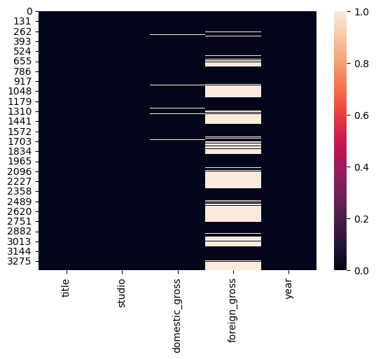
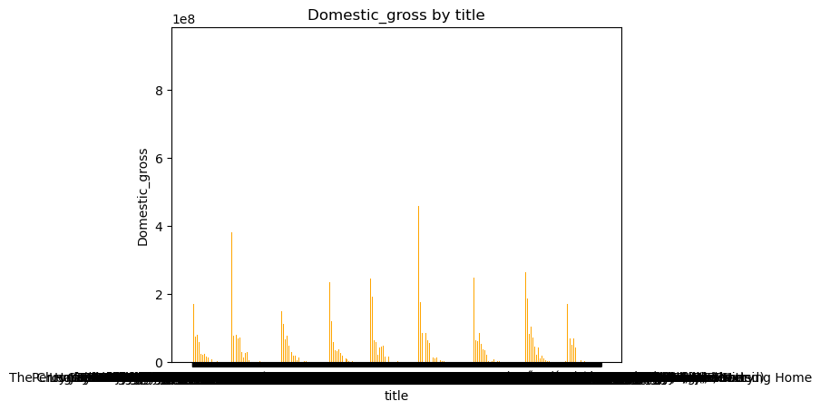
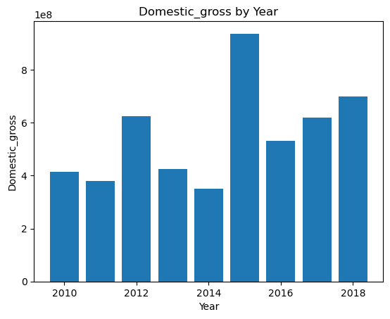
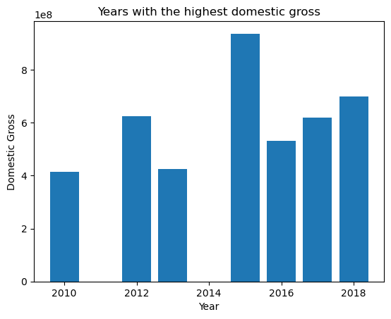
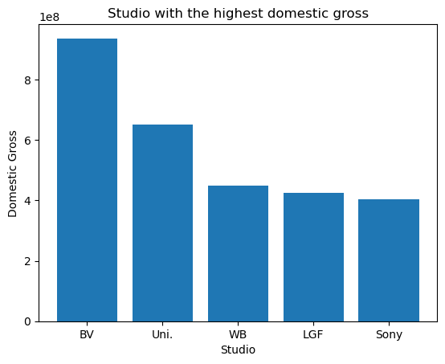
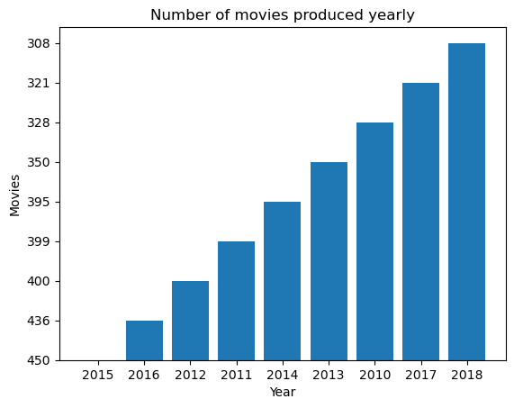
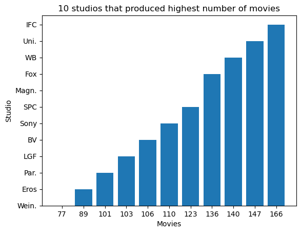

```python
import pandas as pd
import matplotlib.pyplot as plt
import numpy as np
```


```python

```


```python
import seaborn as sns
```


```python
df = pd.read_csv("bom.movie_gross.csv.gz")
df.head()
```


<div>
<style scoped>
    .dataframe tbody tr th:only-of-type {
        vertical-align: middle;
    }

    .dataframe tbody tr th {
        vertical-align: top;
    }

    .dataframe thead th {
        text-align: right;
    }
</style>
<table border="1" class="dataframe">
  <thead>
    <tr style="text-align: right;">
      <th></th>
      <th>title</th>
      <th>studio</th>
      <th>domestic_gross</th>
      <th>foreign_gross</th>
      <th>year</th>
    </tr>
  </thead>
  <tbody>
    <tr>
      <th>0</th>
      <td>Toy Story 3</td>
      <td>BV</td>
      <td>415000000.0</td>
      <td>652000000</td>
      <td>2010</td>
    </tr>
    <tr>
      <th>1</th>
      <td>Alice in Wonderland (2010)</td>
      <td>BV</td>
      <td>334200000.0</td>
      <td>691300000</td>
      <td>2010</td>
    </tr>
    <tr>
      <th>2</th>
      <td>Harry Potter and the Deathly Hallows Part 1</td>
      <td>WB</td>
      <td>296000000.0</td>
      <td>664300000</td>
      <td>2010</td>
    </tr>
    <tr>
      <th>3</th>
      <td>Inception</td>
      <td>WB</td>
      <td>292600000.0</td>
      <td>535700000</td>
      <td>2010</td>
    </tr>
    <tr>
      <th>4</th>
      <td>Shrek Forever After</td>
      <td>P/DW</td>
      <td>238700000.0</td>
      <td>513900000</td>
      <td>2010</td>
    </tr>
  </tbody>
</table>
</div>


```python
df.shape
```


    (3387, 5)


```python
value = df.isnull().values.any()
value
```


    True


```python
result = df.isnull().sum()
result
```


    title                0
    studio               5
    domestic_gross      28
    foreign_gross     1350
    year                 0
    dtype: int64


```python
sns.heatmap(df.isnull())
```


    <Axes: >


    

    


```python
per_missing = df.isnull().sum()*100 / len(df)
per_missing
```


    title              0.000000
    studio             0.147623
    domestic_gross     0.826690
    foreign_gross     39.858282
    year               0.000000
    dtype: float64


```python
df2=df.fillna(0)
df2
```


<div>
<style scoped>
    .dataframe tbody tr th:only-of-type {
        vertical-align: middle;
    }

    .dataframe tbody tr th {
        vertical-align: top;
    }

    .dataframe thead th {
        text-align: right;
    }
</style>
<table border="1" class="dataframe">
  <thead>
    <tr style="text-align: right;">
      <th></th>
      <th>title</th>
      <th>studio</th>
      <th>domestic_gross</th>
      <th>foreign_gross</th>
      <th>year</th>
    </tr>
  </thead>
  <tbody>
    <tr>
      <th>0</th>
      <td>Toy Story 3</td>
      <td>BV</td>
      <td>415000000.0</td>
      <td>652000000</td>
      <td>2010</td>
    </tr>
    <tr>
      <th>1</th>
      <td>Alice in Wonderland (2010)</td>
      <td>BV</td>
      <td>334200000.0</td>
      <td>691300000</td>
      <td>2010</td>
    </tr>
    <tr>
      <th>2</th>
      <td>Harry Potter and the Deathly Hallows Part 1</td>
      <td>WB</td>
      <td>296000000.0</td>
      <td>664300000</td>
      <td>2010</td>
    </tr>
    <tr>
      <th>3</th>
      <td>Inception</td>
      <td>WB</td>
      <td>292600000.0</td>
      <td>535700000</td>
      <td>2010</td>
    </tr>
    <tr>
      <th>4</th>
      <td>Shrek Forever After</td>
      <td>P/DW</td>
      <td>238700000.0</td>
      <td>513900000</td>
      <td>2010</td>
    </tr>
    <tr>
      <th>...</th>
      <td>...</td>
      <td>...</td>
      <td>...</td>
      <td>...</td>
      <td>...</td>
    </tr>
    <tr>
      <th>3382</th>
      <td>The Quake</td>
      <td>Magn.</td>
      <td>6200.0</td>
      <td>0</td>
      <td>2018</td>
    </tr>
    <tr>
      <th>3383</th>
      <td>Edward II (2018 re-release)</td>
      <td>FM</td>
      <td>4800.0</td>
      <td>0</td>
      <td>2018</td>
    </tr>
    <tr>
      <th>3384</th>
      <td>El Pacto</td>
      <td>Sony</td>
      <td>2500.0</td>
      <td>0</td>
      <td>2018</td>
    </tr>
    <tr>
      <th>3385</th>
      <td>The Swan</td>
      <td>Synergetic</td>
      <td>2400.0</td>
      <td>0</td>
      <td>2018</td>
    </tr>
    <tr>
      <th>3386</th>
      <td>An Actor Prepares</td>
      <td>Grav.</td>
      <td>1700.0</td>
      <td>0</td>
      <td>2018</td>
    </tr>
  </tbody>
</table>
<p>3387 rows × 5 columns</p>
</div>


```python
df2.isnull().sum()
```


    title             0
    studio            0
    domestic_gross    0
    foreign_gross     0
    year              0
    dtype: int64


```python
#Checking for dups
dup_df2=df2.duplicated().any()
dup_df2
```


    False


```python
means= df["domestic_gross"].mean()
means
```


    28745845.06698422


```python
stats=df2.describe()
stats
```


<div>
<style scoped>
    .dataframe tbody tr th:only-of-type {
        vertical-align: middle;
    }

    .dataframe tbody tr th {
        vertical-align: top;
    }

    .dataframe thead th {
        text-align: right;
    }
</style>
<table border="1" class="dataframe">
  <thead>
    <tr style="text-align: right;">
      <th></th>
      <th>domestic_gross</th>
      <th>year</th>
    </tr>
  </thead>
  <tbody>
    <tr>
      <th>count</th>
      <td>3.387000e+03</td>
      <td>3387.000000</td>
    </tr>
    <tr>
      <th>mean</th>
      <td>2.850821e+07</td>
      <td>2013.958075</td>
    </tr>
    <tr>
      <th>std</th>
      <td>6.675575e+07</td>
      <td>2.478141</td>
    </tr>
    <tr>
      <th>min</th>
      <td>0.000000e+00</td>
      <td>2010.000000</td>
    </tr>
    <tr>
      <th>25%</th>
      <td>1.115000e+05</td>
      <td>2012.000000</td>
    </tr>
    <tr>
      <th>50%</th>
      <td>1.300000e+06</td>
      <td>2014.000000</td>
    </tr>
    <tr>
      <th>75%</th>
      <td>2.750000e+07</td>
      <td>2016.000000</td>
    </tr>
    <tr>
      <th>max</th>
      <td>9.367000e+08</td>
      <td>2018.000000</td>
    </tr>
  </tbody>
</table>
</div>


```python

```


```python
#top 20 movies with above av. domestic gross
best_perf =df.loc[df['domestic_gross']>47019840] ['title']
best_perf.head(20)
```


    0                                           Toy Story 3
    1                            Alice in Wonderland (2010)
    2           Harry Potter and the Deathly Hallows Part 1
    3                                             Inception
    4                                   Shrek Forever After
    5                            The Twilight Saga: Eclipse
    6                                            Iron Man 2
    7                                               Tangled
    8                                         Despicable Me
    9                              How to Train Your Dragon
    10                           Clash of the Titans (2010)
    11    The Chronicles of Narnia: The Voyage of the Da...
    12                                    The King's Speech
    13                                          Tron Legacy
    14                                       The Karate Kid
    15                  Prince of Persia: The Sands of Time
    16                                           Black Swan
    17                                             Megamind
    18                                           Robin Hood
    19                                   The Last Airbender
    Name: title, dtype: object


```python
year=best_perf[0]
title=best_perf[1]

plt.bar(year, title)
plt.title('Number of movies produced yearly')
plt.xlabel('Year')
plt.ylabel('Movies')
plt.show

plt.bar(df['title'],df['domestic_gross'], width=0.5, color="orange")
plt.title('Domestic_gross by title')
plt.xlabel('title')
plt.ylabel('Domestic_gross')
plt.show()
```


    

    


```python


```


```python
#Year with the highest dom. gross
df.columns
```


    Index(['title', 'studio', 'domestic_gross', 'foreign_gross', 'year'], dtype='object')


```python
#Year with the highest av dom. gross
av = df.groupby('year')['domestic_gross'].mean().sort_values()
av.head(10)
```


    year
    2015    2.461338e+07
    2011    2.535052e+07
    2016    2.598996e+07
    2014    2.643923e+07
    2012    2.767584e+07
    2013    3.128212e+07
    2010    3.144559e+07
    2017    3.416646e+07
    2018    3.601042e+07
    Name: domestic_gross, dtype: float64


```python
plt.bar(df['year'], df['domestic_gross'])
plt.title('Domestic_gross by Year')
plt.xlabel('Year')
plt.ylabel('Domestic_gross')
plt.show()
```


    

    


```python

```


```python

```


```python

```


```python

```


```python
df.columns
```


    Index(['title', 'studio', 'domestic_gross', 'foreign_gross', 'year'], dtype='object')


```python
#display top 20 movies with the highest dom.gross
studio_gross = df.nlargest(20,'domestic_gross')
studio_gross
```


<div>
<style scoped>
    .dataframe tbody tr th:only-of-type {
        vertical-align: middle;
    }

    .dataframe tbody tr th {
        vertical-align: top;
    }

    .dataframe thead th {
        text-align: right;
    }
</style>
<table border="1" class="dataframe">
  <thead>
    <tr style="text-align: right;">
      <th></th>
      <th>title</th>
      <th>studio</th>
      <th>domestic_gross</th>
      <th>foreign_gross</th>
      <th>year</th>
    </tr>
  </thead>
  <tbody>
    <tr>
      <th>1872</th>
      <td>Star Wars: The Force Awakens</td>
      <td>BV</td>
      <td>936700000.0</td>
      <td>1,131.6</td>
      <td>2015</td>
    </tr>
    <tr>
      <th>3080</th>
      <td>Black Panther</td>
      <td>BV</td>
      <td>700100000.0</td>
      <td>646900000</td>
      <td>2018</td>
    </tr>
    <tr>
      <th>3079</th>
      <td>Avengers: Infinity War</td>
      <td>BV</td>
      <td>678800000.0</td>
      <td>1,369.5</td>
      <td>2018</td>
    </tr>
    <tr>
      <th>1873</th>
      <td>Jurassic World</td>
      <td>Uni.</td>
      <td>652300000.0</td>
      <td>1,019.4</td>
      <td>2015</td>
    </tr>
    <tr>
      <th>727</th>
      <td>Marvel's The Avengers</td>
      <td>BV</td>
      <td>623400000.0</td>
      <td>895500000</td>
      <td>2012</td>
    </tr>
    <tr>
      <th>2758</th>
      <td>Star Wars: The Last Jedi</td>
      <td>BV</td>
      <td>620200000.0</td>
      <td>712400000</td>
      <td>2017</td>
    </tr>
    <tr>
      <th>3082</th>
      <td>Incredibles 2</td>
      <td>BV</td>
      <td>608600000.0</td>
      <td>634200000</td>
      <td>2018</td>
    </tr>
    <tr>
      <th>2323</th>
      <td>Rogue One: A Star Wars Story</td>
      <td>BV</td>
      <td>532200000.0</td>
      <td>523900000</td>
      <td>2016</td>
    </tr>
    <tr>
      <th>2759</th>
      <td>Beauty and the Beast (2017)</td>
      <td>BV</td>
      <td>504000000.0</td>
      <td>759500000</td>
      <td>2017</td>
    </tr>
    <tr>
      <th>2324</th>
      <td>Finding Dory</td>
      <td>BV</td>
      <td>486300000.0</td>
      <td>542300000</td>
      <td>2016</td>
    </tr>
    <tr>
      <th>1875</th>
      <td>Avengers: Age of Ultron</td>
      <td>BV</td>
      <td>459000000.0</td>
      <td>946400000</td>
      <td>2015</td>
    </tr>
    <tr>
      <th>729</th>
      <td>The Dark Knight Rises</td>
      <td>WB</td>
      <td>448100000.0</td>
      <td>636800000</td>
      <td>2012</td>
    </tr>
    <tr>
      <th>1131</th>
      <td>The Hunger Games: Catching Fire</td>
      <td>LGF</td>
      <td>424700000.0</td>
      <td>440300000</td>
      <td>2013</td>
    </tr>
    <tr>
      <th>3081</th>
      <td>Jurassic World: Fallen Kingdom</td>
      <td>Uni.</td>
      <td>417700000.0</td>
      <td>891800000</td>
      <td>2018</td>
    </tr>
    <tr>
      <th>0</th>
      <td>Toy Story 3</td>
      <td>BV</td>
      <td>415000000.0</td>
      <td>652000000</td>
      <td>2010</td>
    </tr>
    <tr>
      <th>2767</th>
      <td>Wonder Woman</td>
      <td>WB</td>
      <td>412600000.0</td>
      <td>409300000</td>
      <td>2017</td>
    </tr>
    <tr>
      <th>1128</th>
      <td>Iron Man 3</td>
      <td>BV</td>
      <td>409000000.0</td>
      <td>805800000</td>
      <td>2013</td>
    </tr>
    <tr>
      <th>2322</th>
      <td>Captain America: Civil War</td>
      <td>BV</td>
      <td>408100000.0</td>
      <td>745200000</td>
      <td>2016</td>
    </tr>
    <tr>
      <th>735</th>
      <td>The Hunger Games</td>
      <td>LGF</td>
      <td>408000000.0</td>
      <td>286400000</td>
      <td>2012</td>
    </tr>
    <tr>
      <th>2762</th>
      <td>Jumanji: Welcome to the Jungle</td>
      <td>Sony</td>
      <td>404500000.0</td>
      <td>557600000</td>
      <td>2017</td>
    </tr>
  </tbody>
</table>
</div>


```python
year=studio_gross['year']
domestic_gross=studio_gross['domestic_gross']

plt.bar(year, domestic_gross)
plt.title('Years with the highest domestic gross')
plt.xlabel('Year')
plt.ylabel('Domestic Gross')
plt.show
```


    <function matplotlib.pyplot.show(close=None, block=None)>


    

    


```python
#Studio with the highest domestic gross
studio=studio_gross['studio']
domestic_gross=studio_gross['domestic_gross']

plt.bar(studio, domestic_gross)
plt.title('Studio with the highest domestic gross')
plt.xlabel('Studio')
plt.ylabel('Domestic Gross')
plt.show
```


    <function matplotlib.pyplot.show(close=None, block=None)>


    

    


```python

```


```python


```


```python

```


```python

```


```python

```


```python
#plt.bar(df['domestic_gross'], df['studio'], width=0.5, color="orange")
#plt.title('Studio making the highest dom gross')
#plt.xlabel('domestic_gross')
#plt.ylabel('top10_movies.index,df=top10_movies')
#plt.show()
```


```python
#No of movies produced per year
df.columns

```


    Index(['title', 'studio', 'domestic_gross', 'foreign_gross', 'year'], dtype='object')


```python
movies_yearly=df['year'].value_counts()
movies_yearly
```


    year
    2015    450
    2016    436
    2012    400
    2011    399
    2014    395
    2013    350
    2010    328
    2017    321
    2018    308
    Name: count, dtype: int64


```python
year= ['2015', '2016', '2012', '2011', '2014', '2013', '2010', '2017', '2018']
movies=['450', '436', '400', '399', '395', '350', '328', '321', '308']
new = pd.DataFrame(list(zip(year, movies)))
new
```


<div>
<style scoped>
    .dataframe tbody tr th:only-of-type {
        vertical-align: middle;
    }

    .dataframe tbody tr th {
        vertical-align: top;
    }

    .dataframe thead th {
        text-align: right;
    }
</style>
<table border="1" class="dataframe">
  <thead>
    <tr style="text-align: right;">
      <th></th>
      <th>0</th>
      <th>1</th>
    </tr>
  </thead>
  <tbody>
    <tr>
      <th>0</th>
      <td>2015</td>
      <td>450</td>
    </tr>
    <tr>
      <th>1</th>
      <td>2016</td>
      <td>436</td>
    </tr>
    <tr>
      <th>2</th>
      <td>2012</td>
      <td>400</td>
    </tr>
    <tr>
      <th>3</th>
      <td>2011</td>
      <td>399</td>
    </tr>
    <tr>
      <th>4</th>
      <td>2014</td>
      <td>395</td>
    </tr>
    <tr>
      <th>5</th>
      <td>2013</td>
      <td>350</td>
    </tr>
    <tr>
      <th>6</th>
      <td>2010</td>
      <td>328</td>
    </tr>
    <tr>
      <th>7</th>
      <td>2017</td>
      <td>321</td>
    </tr>
    <tr>
      <th>8</th>
      <td>2018</td>
      <td>308</td>
    </tr>
  </tbody>
</table>
</div>


```python

```


```python
year=new[0]
title=new[1]

plt.bar(year, title)
plt.title('Number of movies produced yearly')
plt.xlabel('Year')
plt.ylabel('Movies')
plt.show
```


    <function matplotlib.pyplot.show(close=None, block=None)>


    

    


```python

```


```python
#Most popular studio(Highest movie no.of movies produced)
```


```python
df[df['title'].max()==df['title']]['studio']
```


    2785    Par.
    Name: studio, dtype: object


```python
#Display top 20 movies with best domestic gross and their studio
```


```python
df.columns
```


    Index(['title', 'studio', 'domestic_gross', 'foreign_gross', 'year'], dtype='object')


```python

```


```python
 
```


```python
top20_movies=df.nlargest(20,'domestic_gross')[['domestic_gross','studio','title' ]]\
.set_index('title')
```


```python
top20_movies
```


<div>
<style scoped>
    .dataframe tbody tr th:only-of-type {
        vertical-align: middle;
    }

    .dataframe tbody tr th {
        vertical-align: top;
    }

    .dataframe thead th {
        text-align: right;
    }
</style>
<table border="1" class="dataframe">
  <thead>
    <tr style="text-align: right;">
      <th></th>
      <th>domestic_gross</th>
      <th>studio</th>
    </tr>
    <tr>
      <th>title</th>
      <th></th>
      <th></th>
    </tr>
  </thead>
  <tbody>
    <tr>
      <th>Star Wars: The Force Awakens</th>
      <td>936700000.0</td>
      <td>BV</td>
    </tr>
    <tr>
      <th>Black Panther</th>
      <td>700100000.0</td>
      <td>BV</td>
    </tr>
    <tr>
      <th>Avengers: Infinity War</th>
      <td>678800000.0</td>
      <td>BV</td>
    </tr>
    <tr>
      <th>Jurassic World</th>
      <td>652300000.0</td>
      <td>Uni.</td>
    </tr>
    <tr>
      <th>Marvel's The Avengers</th>
      <td>623400000.0</td>
      <td>BV</td>
    </tr>
    <tr>
      <th>Star Wars: The Last Jedi</th>
      <td>620200000.0</td>
      <td>BV</td>
    </tr>
    <tr>
      <th>Incredibles 2</th>
      <td>608600000.0</td>
      <td>BV</td>
    </tr>
    <tr>
      <th>Rogue One: A Star Wars Story</th>
      <td>532200000.0</td>
      <td>BV</td>
    </tr>
    <tr>
      <th>Beauty and the Beast (2017)</th>
      <td>504000000.0</td>
      <td>BV</td>
    </tr>
    <tr>
      <th>Finding Dory</th>
      <td>486300000.0</td>
      <td>BV</td>
    </tr>
    <tr>
      <th>Avengers: Age of Ultron</th>
      <td>459000000.0</td>
      <td>BV</td>
    </tr>
    <tr>
      <th>The Dark Knight Rises</th>
      <td>448100000.0</td>
      <td>WB</td>
    </tr>
    <tr>
      <th>The Hunger Games: Catching Fire</th>
      <td>424700000.0</td>
      <td>LGF</td>
    </tr>
    <tr>
      <th>Jurassic World: Fallen Kingdom</th>
      <td>417700000.0</td>
      <td>Uni.</td>
    </tr>
    <tr>
      <th>Toy Story 3</th>
      <td>415000000.0</td>
      <td>BV</td>
    </tr>
    <tr>
      <th>Wonder Woman</th>
      <td>412600000.0</td>
      <td>WB</td>
    </tr>
    <tr>
      <th>Iron Man 3</th>
      <td>409000000.0</td>
      <td>BV</td>
    </tr>
    <tr>
      <th>Captain America: Civil War</th>
      <td>408100000.0</td>
      <td>BV</td>
    </tr>
    <tr>
      <th>The Hunger Games</th>
      <td>408000000.0</td>
      <td>LGF</td>
    </tr>
    <tr>
      <th>Jumanji: Welcome to the Jungle</th>
      <td>404500000.0</td>
      <td>Sony</td>
    </tr>
  </tbody>
</table>
</div>


```python

 #Unique values from studio column
one_d=df['studio']
one_d
```


    0               BV
    1               BV
    2               WB
    3               WB
    4             P/DW
               ...    
    3382         Magn.
    3383            FM
    3384          Sony
    3385    Synergetic
    3386         Grav.
    Name: studio, Length: 3387, dtype: object


```python
unistudio = df['studio'].unique()
unistudio

        
```


    array(['BV', 'WB', 'P/DW', 'Sum.', 'Par.', 'Uni.', 'Fox', 'Wein.', 'Sony',
           'FoxS', 'SGem', 'WB (NL)', 'LGF', 'MBox', 'CL', 'W/Dim.', 'CBS',
           'Focus', 'MGM', 'Over.', 'Mira.', 'IFC', 'CJ', 'NM', 'SPC', 'ParV',
           'Gold.', 'JS', 'RAtt.', 'Magn.', 'Free', '3D', 'UTV', 'Rela.',
           'Zeit.', 'Anch.', 'PDA', 'Lorb.', 'App.', 'Drft.', 'Osci.', 'IW',
           'Rog.', nan, 'Eros', 'Relbig.', 'Viv.', 'Hann.', 'Strand', 'NGE',
           'Scre.', 'Kino', 'Abr.', 'CZ', 'ATO', 'First', 'GK', 'FInd.',
           'NFC', 'TFC', 'Pala.', 'Imag.', 'NAV', 'Arth.', 'CLS', 'Mont.',
           'Olive', 'CGld', 'FOAK', 'IVP', 'Yash', 'ICir', 'FM', 'Vita.',
           'WOW', 'Truly', 'Indic.', 'FD', 'Vari.', 'TriS', 'ORF', 'IM',
           'Elev.', 'Cohen', 'NeoC', 'Jan.', 'MNE', 'Trib.', 'Rocket',
           'OMNI/FSR', 'KKM', 'Argo.', 'SMod', 'Libre', 'FRun', 'WHE', 'P4',
           'KC', 'SD', 'AM', 'MPFT', 'Icar.', 'AGF', 'A23', 'Da.', 'NYer',
           'Rialto', 'DF', 'KL', 'ALP', 'LG/S', 'WGUSA', 'MPI', 'RTWC', 'FIP',
           'RF', 'ArcEnt', 'PalUni', 'EpicPics', 'EOne', 'LD', 'AF', 'TFA',
           'Myr.', 'BM&DH', 'SEG', 'PalT', 'Outs', 'OutF', 'BSM', 'WAMCR',
           'PM&E', 'A24', 'Cdgm.', 'Distrib.', 'Imax', 'PH', 'HTR', 'ELS',
           'PI', 'E1', 'TVC', 'FEF', 'EXCL', 'MSF', 'P/108', 'FCW', 'XL',
           'Shout!', 'SV', 'CE', 'VPD', 'KE', 'Saban', 'CF&SR', 'Triu', 'DR',
           'Crnth', 'Ampl.', 'CP', 'Proud', 'BGP', 'Abk.', 'DLA', 'B360',
           'BWP', 'SEA', 'RME', 'KS', 'VE', 'LGP', 'EC', 'FUN', 'STX', 'AR',
           'BG', 'PFR', 'BST', 'BH Tilt', 'BSC', 'U/P', 'UHE', 'CLF', 'FR',
           'AaF', 'Orch.', 'Alc', 'PBS', 'SHO', 'Grav.', 'Gathr', 'Asp.',
           'ADC', 'Rel.', 'SM', 'AZ', 'UEP', 'ITL', 'TA', 'MR', 'BBC',
           'CFilms', 'Part.', 'FOR', 'TAFC', 'JBG', 'PNT', 'CineGalaxy',
           'Fathom', 'Zee', 'Men.', 'YFG', 'Gaatri', 'Mon', 'Ghop',
           'Cleopatra', 'Dreamwest', 'SDS', 'Linn', 'Electric', 'Jampa', 'HC',
           'GrtIndia', 'Neon', 'ENTMP', 'Good Deed', 'ParC', 'Aviron',
           'Annapurna', 'Amazon', 'Affirm', 'MOM', 'Orion', 'CFI', 'UTMW',
           'Crimson', 'CAVU', 'EF', 'Arrow', 'Hiber', 'Studio 8',
           'Global Road', 'Trafalgar', 'Greenwich', 'Spanglish', 'Blue Fox',
           'RLJ', 'Swen', 'PackYourBag', 'Gaum.', 'Grindstone',
           'Conglomerate', 'MUBI', 'Darin Southa', 'Super', 'CARUSEL', 'PDF',
           'Synergetic'], dtype=object)


```python
df['studio'].nunique()
```


    257


```python
df.head()
```


<div>
<style scoped>
    .dataframe tbody tr th:only-of-type {
        vertical-align: middle;
    }

    .dataframe tbody tr th {
        vertical-align: top;
    }

    .dataframe thead th {
        text-align: right;
    }
</style>
<table border="1" class="dataframe">
  <thead>
    <tr style="text-align: right;">
      <th></th>
      <th>title</th>
      <th>studio</th>
      <th>domestic_gross</th>
      <th>foreign_gross</th>
      <th>year</th>
    </tr>
  </thead>
  <tbody>
    <tr>
      <th>0</th>
      <td>Toy Story 3</td>
      <td>BV</td>
      <td>415000000.0</td>
      <td>652000000</td>
      <td>2010</td>
    </tr>
    <tr>
      <th>1</th>
      <td>Alice in Wonderland (2010)</td>
      <td>BV</td>
      <td>334200000.0</td>
      <td>691300000</td>
      <td>2010</td>
    </tr>
    <tr>
      <th>2</th>
      <td>Harry Potter and the Deathly Hallows Part 1</td>
      <td>WB</td>
      <td>296000000.0</td>
      <td>664300000</td>
      <td>2010</td>
    </tr>
    <tr>
      <th>3</th>
      <td>Inception</td>
      <td>WB</td>
      <td>292600000.0</td>
      <td>535700000</td>
      <td>2010</td>
    </tr>
    <tr>
      <th>4</th>
      <td>Shrek Forever After</td>
      <td>P/DW</td>
      <td>238700000.0</td>
      <td>513900000</td>
      <td>2010</td>
    </tr>
  </tbody>
</table>
</div>


```python
df1 =df.fillna(0)
df1
```


<div>
<style scoped>
    .dataframe tbody tr th:only-of-type {
        vertical-align: middle;
    }

    .dataframe tbody tr th {
        vertical-align: top;
    }

    .dataframe thead th {
        text-align: right;
    }
</style>
<table border="1" class="dataframe">
  <thead>
    <tr style="text-align: right;">
      <th></th>
      <th>title</th>
      <th>studio</th>
      <th>domestic_gross</th>
      <th>foreign_gross</th>
      <th>year</th>
    </tr>
  </thead>
  <tbody>
    <tr>
      <th>0</th>
      <td>Toy Story 3</td>
      <td>BV</td>
      <td>415000000.0</td>
      <td>652000000</td>
      <td>2010</td>
    </tr>
    <tr>
      <th>1</th>
      <td>Alice in Wonderland (2010)</td>
      <td>BV</td>
      <td>334200000.0</td>
      <td>691300000</td>
      <td>2010</td>
    </tr>
    <tr>
      <th>2</th>
      <td>Harry Potter and the Deathly Hallows Part 1</td>
      <td>WB</td>
      <td>296000000.0</td>
      <td>664300000</td>
      <td>2010</td>
    </tr>
    <tr>
      <th>3</th>
      <td>Inception</td>
      <td>WB</td>
      <td>292600000.0</td>
      <td>535700000</td>
      <td>2010</td>
    </tr>
    <tr>
      <th>4</th>
      <td>Shrek Forever After</td>
      <td>P/DW</td>
      <td>238700000.0</td>
      <td>513900000</td>
      <td>2010</td>
    </tr>
    <tr>
      <th>...</th>
      <td>...</td>
      <td>...</td>
      <td>...</td>
      <td>...</td>
      <td>...</td>
    </tr>
    <tr>
      <th>3382</th>
      <td>The Quake</td>
      <td>Magn.</td>
      <td>6200.0</td>
      <td>0</td>
      <td>2018</td>
    </tr>
    <tr>
      <th>3383</th>
      <td>Edward II (2018 re-release)</td>
      <td>FM</td>
      <td>4800.0</td>
      <td>0</td>
      <td>2018</td>
    </tr>
    <tr>
      <th>3384</th>
      <td>El Pacto</td>
      <td>Sony</td>
      <td>2500.0</td>
      <td>0</td>
      <td>2018</td>
    </tr>
    <tr>
      <th>3385</th>
      <td>The Swan</td>
      <td>Synergetic</td>
      <td>2400.0</td>
      <td>0</td>
      <td>2018</td>
    </tr>
    <tr>
      <th>3386</th>
      <td>An Actor Prepares</td>
      <td>Grav.</td>
      <td>1700.0</td>
      <td>0</td>
      <td>2018</td>
    </tr>
  </tbody>
</table>
<p>3387 rows × 5 columns</p>
</div>


```python
df['domestic_gross'].tolist()
```


    [415000000.0,
     334200000.0,
     296000000.0,
     292600000.0,
     238700000.0,
     300500000.0,
     312400000.0,
     200800000.0,
     251500000.0,
     217600000.0,
     163200000.0,
     104400000.0,
     135500000.0,
     172100000.0,
     176600000.0,
     90800000.0,
     107000000.0,
     148400000.0,
     105300000.0,
     131800000.0,
     148400000.0,
     60100000.0,
     128000000.0,
     118300000.0,
     95300000.0,
     67600000.0,
     103100000.0,
     162000000.0,
     76400000.0,
     171200000.0,
     42800000.0,
     88800000.0,
     97000000.0,
     110500000.0,
     63200000.0,
     100500000.0,
     80600000.0,
     100200000.0,
     90400000.0,
     84800000.0,
     77200000.0,
     117200000.0,
     119200000.0,
     81600000.0,
     42400000.0,
     94800000.0,
     92200000.0,
     98700000.0,
     55700000.0,
     62000000.0,
     67099999.0,
     45700000.0,
     52500000.0,
     93600000.0,
     52000000.0,
     63100000.0,
     80000000.0,
     43600000.0,
     60000000.0,
     53400000.0,
     32700000.0,
     10100000.0,
     32400000.0,
     63000.0,
     47100000.0,
     48100000.0,
     35100000.0,
     29000000.0,
     61000000.0,
     39400000.0,
     63000000.0,
     73000000.0,
     33600000.0,
     25000000.0,
     19400000.0,
     43300000.0,
     36700000.0,
     53000000.0,
     37500000.0,
     427000.0,
     64000000.0,
     58400000.0,
     52400000.0,
     57700000.0,
     48500.0,
     40200000.0,
     35600000.0,
     41000000.0,
     21100000.0,
     7600000.0,
     21400000.0,
     50300000.0,
     33600000.0,
     18300000.0,
     60100000.0,
     59700000.0,
     15500000.0,
     31000000.0,
     19100000.0,
     44900000.0,
     39100000.0,
     24100000.0,
     30100000.0,
     25100000.0,
     27800000.0,
     32000000.0,
     42700000.0,
     30200000.0,
     31200000.0,
     31500000.0,
     504000.0,
     24300000.0,
     128000.0,
     26600000.0,
     5200000.0,
     528000.0,
     32700000.0,
     4000000.0,
     17800000.0,
     658000.0,
     619000.0,
     37700000.0,
     27200000.0,
     17600000.0,
     23200000.0,
     20800000.0,
     3200000.0,
     6400000.0,
     10700000.0,
     25900000.0,
     25700000.0,
     552000.0,
     23600000.0,
     13300000.0,
     26200000.0,
     17000000.0,
     9500000.0,
     12100000.0,
     4800000.0,
     21500000.0,
     20300000.0,
     14700000.0,
     177000.0,
     2000000.0,
     20200000.0,
     3200000.0,
     15300000.0,
     1000000.0,
     27800.0,
     13800000.0,
     2100000.0,
     277000.0,
     552000.0,
     1300000.0,
     195000.0,
     6100000.0,
     848000.0,
     12100000.0,
     1800000.0,
     6500000.0,
     6600000.0,
     1500000.0,
     1100000.0,
     9700000.0,
     560000.0,
     3100000.0,
     55800.0,
     5700000.0,
     5000000.0,
     10500000.0,
     1800000.0,
     7500000.0,
     6800000.0,
     9200000.0,
     7300000.0,
     1800000.0,
     758000.0,
     2400000.0,
     675000.0,
     8500000.0,
     6700000.0,
     4300000.0,
     1500000.0,
     124000.0,
     1000000.0,
     1500000.0,
     6400000.0,
     6400000.0,
     4200000.0,
     1600000.0,
     619000.0,
     2200000.0,
     3300000.0,
     532000.0,
     4400000.0,
     2200000.0,
     435000.0,
     1100000.0,
     3600000.0,
     305000.0,
     404000.0,
     4000000.0,
     237000.0,
     236000.0,
     217000.0,
     1000000.0,
     3800000.0,
     108000.0,
     3200000.0,
     109000.0,
     96900.0,
     246000.0,
     1300000.0,
     1600000.0,
     2800000.0,
     184000.0,
     1100000.0,
     375000.0,
     1200000.0,
     1100000.0,
     109000.0,
     1600000.0,
     1800000.0,
     1000000.0,
     550000.0,
     855000.0,
     67500.0,
     1300000.0,
     709000.0,
     493000.0,
     nan,
     622000.0,
     37000.0,
     368000.0,
     617000.0,
     23700.0,
     246000.0,
     915000.0,
     1000000.0,
     176000.0,
     542000.0,
     638000.0,
     70100.0,
     711000.0,
     341000.0,
     81800.0,
     146000.0,
     34500.0,
     167000.0,
     428000.0,
     527000.0,
     281000.0,
     336000.0,
     677000.0,
     673000.0,
     285000.0,
     582000.0,
     542000.0,
     303000.0,
     139000.0,
     93100.0,
     409000.0,
     11700.0,
     109000.0,
     144000.0,
     115000.0,
     453000.0,
     392000.0,
     110000.0,
     366000.0,
     278000.0,
     20900.0,
     225000.0,
     21100.0,
     159000.0,
     191000.0,
     208000.0,
     275000.0,
     39000.0,
     286000.0,
     288000.0,
     26300.0,
     188000.0,
     199000.0,
     181000.0,
     128000.0,
     2200.0,
     207000.0,
     17400.0,
     169000.0,
     189000.0,
     177000.0,
     800.0,
     33200.0,
     10800.0,
     133000.0,
     102000.0,
     107000.0,
     nan,
     101000.0,
     103000.0,
     43800.0,
     nan,
     81700.0,
     80700.0,
     73200.0,
     nan,
     5000.0,
     61600.0,
     2000.0,
     4100.0,
     52600.0,
     36100.0,
     30800.0,
     2600.0,
     10000.0,
     37200.0,
     33500.0,
     21800.0,
     32200.0,
     18000.0,
     12000.0,
     7400.0,
     11400.0,
     11400.0,
     10800.0,
     4400.0,
     nan,
     381000000.0,
     352400000.0,
     241100000.0,
     281300000.0,
     209400000.0,
     165200000.0,
     209800000.0,
     254500000.0,
     142600000.0,
     191500000.0,
     149300000.0,
     186800000.0,
     143600000.0,
     176800000.0,
     181000000.0,
     77600000.0,
     176700000.0,
     146400000.0,
     133100000.0,
     85500000.0,
     169100000.0,
     127000000.0,
     123500000.0,
     102500000.0,
     98800000.0,
     83500000.0,
     116600000.0,
     169700000.0,
     100300000.0,
     103000000.0,
     83600000.0,
     117500000.0,
     104000000.0,
     100000000.0,
     68200000.0,
     73900000.0,
     94200000.0,
     108100000.0,
     79900000.0,
     82600000.0,
     100200000.0,
     37500000.0,
     80400000.0,
     88600000.0,
     79200000.0,
     8300000.0,
     42600000.0,
     78000000.0,
     56800000.0,
     64000000.0,
     55100000.0,
     74200000.0,
     55800000.0,
     70700000.0,
     46500000.0,
     54700000.0,
     84400000.0,
     54500000.0,
     75700000.0,
     44700000.0,
     20400000.0,
     63700000.0,
     62500000.0,
     75600000.0,
     58700000.0,
     30000000.0,
     75600000.0,
     23200000.0,
     73000000.0,
     37400000.0,
     38200000.0,
     54000000.0,
     33000000.0,
     72300000.0,
     24800000.0,
     36400000.0,
     37700000.0,
     38500000.0,
     37300000.0,
     45100000.0,
     37900000.0,
     28100000.0,
     24100000.0,
     29100000.0,
     35100000.0,
     29100000.0,
     41000000.0,
     37100000.0,
     58000000.0,
     52700000.0,
     35600000.0,
     48500000.0,
     21400000.0,
     40300000.0,
     51800000.0,
     100000.0,
     36700000.0,
     39000000.0,
     13800000.0,
     151000.0,
     25100000.0,
     31800000.0,
     13300000.0,
     53300000.0,
     460000.0,
     26700000.0,
     21300000.0,
     43900000.0,
     251000.0,
     33000000.0,
     31200000.0,
     27900000.0,
     4000000.0,
     25900000.0,
     134000.0,
     18300000.0,
     37100000.0,
     37300000.0,
     18900000.0,
     23200000.0,
     35000000.0,
     21400000.0,
     21300000.0,
     37300000.0,
     24000000.0,
     2500000.0,
     35100000.0,
     14600000.0,
     30400000.0,
     11200000.0,
     34500000.0,
     66100.0,
     15400000.0,
     3200000.0,
     9700000.0,
     14000000.0,
     10700000.0,
     2500000.0,
     5700000.0,
     16900000.0,
     19500000.0,
     50400.0,
     17700000.0,
     5100000.0,
     21600000.0,
     24800000.0,
     13100000.0,
     720000.0,
     1600000.0,
     13700000.0,
     16300000.0,
     7700000.0,
     2700000.0,
     7100000.0,
     5400000.0,
     5400000.0,
     11900000.0,
     3900000.0,
     803000.0,
     10100000.0,
     10400.0,
     164000.0,
     1500000.0,
     3000000.0,
     15000000.0,
     11500000.0,
     4500000.0,
     206000.0,
     158000.0,
     44300.0,
     3500000.0,
     5800000.0,
     667000.0,
     129000.0,
     708000.0,
     233000.0,
     69000.0,
     124000.0,
     1300000.0,
     10200000.0,
     5700000.0,
     123000.0,
     612000.0,
     10300000.0,
     10100000.0,
     1000000.0,
     24100.0,
     1400000.0,
     708000.0,
     543000.0,
     4400000.0,
     44700.0,
     1600000.0,
     99000.0,
     7200000.0,
     971000.0,
     6900000.0,
     6900000.0,
     352000.0,
     5300000.0,
     153000.0,
     1700000.0,
     1000000.0,
     518000.0,
     162000.0,
     32800.0,
     1400000.0,
     464000.0,
     4400000.0,
     nan,
     224000.0,
     16100.0,
     1200000.0,
     514000.0,
     4400000.0,
     4800.0,
     7600.0,
     501000.0,
     253000.0,
     4000000.0,
     85500.0,
     3400000.0,
     138000.0,
     3700000.0,
     540000.0,
     2100000.0,
     3000000.0,
     70600.0,
     3300000.0,
     539000.0,
     40500.0,
     3000000.0,
     5000.0,
     3100000.0,
     1700000.0,
     555000.0,
     45800.0,
     161000.0,
     1500000.0,
     2700000.0,
     60000.0,
     143000.0,
     14900.0,
     356000.0,
     71200.0,
     47900.0,
     2000000.0,
     14600.0,
     1800000.0,
     230000.0,
     37700.0,
     29300.0,
     1300000.0,
     1800000.0,
     1700.0,
     993000.0,
     1500000.0,
     1400000.0,
     1400000.0,
     184000.0,
     1100000.0,
     1100000.0,
     7200.0,
     1100000.0,
     19600.0,
     1100000.0,
     22700.0,
     1100000.0,
     32900.0,
     987000.0,
     978000.0,
     45500.0,
     955000.0,
     373000.0,
     468000.0,
     842000.0,
     708000.0,
     3200.0,
     6300.0,
     728000.0,
     332000.0,
     703000.0,
     697000.0,
     577000.0,
     651000.0,
     638000.0,
     441000.0,
     8200.0,
     201000.0,
     8700.0,
     9200.0,
     68700.0,
     569000.0,
     564000.0,
     544000.0,
     119000.0,
     496000.0,
     485000.0,
     3000.0,
     454000.0,
     25400.0,
     411000.0,
     5600.0,
     64000.0,
     383000.0,
     270000.0,
     8500.0,
     351000.0,
     312000.0,
     328000.0,
     312000.0,
     304000.0,
     304000.0,
     8900.0,
     700.0,
     282000.0,
     274000.0,
     274000.0,
     22600.0,
     153000.0,
     253000.0,
     4200.0,
     1400.0,
     237000.0,
     12100.0,
     224000.0,
     216000.0,
     83500.0,
     103000.0,
     200000.0,
     33000.0,
     189000.0,
     13000.0,
     9900.0,
     184000.0,
     164000.0,
     15800.0,
     168000.0,
     163000.0,
     40300.0,
     155000.0,
     153000.0,
     151000.0,
     142000.0,
     141000.0,
     140000.0,
     136000.0,
     134000.0,
     130000.0,
     32100.0,
     21600.0,
     111000.0,
     86000.0,
     120000.0,
     106000.0,
     100000.0,
     100000.0,
     94300.0,
     81900.0,
     77200.0,
     68900.0,
     66200.0,
     27800.0,
     61800.0,
     59500.0,
     55100.0,
     51200.0,
     48600.0,
     46500.0,
     45200.0,
     41000.0,
     40600.0,
     39500.0,
     36600.0,
     36500.0,
     34800.0,
     33200.0,
     19700.0,
     30700.0,
     30100.0,
     29100.0,
     22300.0,
     22300.0,
     8700.0,
     21400.0,
     nan,
     17500.0,
     5700.0,
     10700.0,
     8000.0,
     6900.0,
     6400.0,
     6300.0,
     4000.0,
     2800.0,
     2600.0,
     2600.0,
     1900.0,
     1300.0,
     623400000.0,
     304400000.0,
     448100000.0,
     303000000.0,
     161300000.0,
     292300000.0,
     262000000.0,
     216400000.0,
     408000000.0,
     179000000.0,
     125000000.0,
     218800000.0,
     237300000.0,
     189400000.0,
     148800000.0,
     10200000.0,
     162800000.0,
     126500000.0,
     155300000.0,
     139900000.0,
     148300000.0,
     214000000.0,
     57900000.0,
     103900000.0,
     85000000.0,
     103400000.0,
     83700000.0,
     65400000.0,
     73100000.0,
     113200000.0,
     182200000.0,
     79700000.0,
     42300000.0,
     132100000.0,
     57000000.0,
     136000000.0,
     80100000.0,
     126400000.0,
     138400000.0,
     58900000.0,
     125000000.0,
     64900000.0,
     19000000.0,
     59700000.0,
     66500000.0,
     113700000.0,
     93800000.0,
     62300000.0,
     54800000.0,
     19200000.0,
     53900000.0,
     35100000.0,
     46400000.0,
     95700000.0,
     51800000.0,
     27100000.0,
     54300000.0,
     64599999.0,
     31100000.0,
     77300000.0,
     37500000.0,
     65000000.0,
     63500000.0,
     56000000.0,
     86900000.0,
     63000.0,
     43500000.0,
     54700000.0,
     53300000.0,
     60500000.0,
     66500000.0,
     91500000.0,
     67500000.0,
     36000.0,
     49100000.0,
     41200000.0,
     686000.0,
     47400000.0,
     35300000.0,
     70000000.0,
     923000.0,
     48100000.0,
     51600000.0,
     49000000.0,
     16700000.0,
     45300000.0,
     41100000.0,
     12800000.0,
     35400000.0,
     45500000.0,
     65700000.0,
     42100000.0,
     47600000.0,
     38500000.0,
     36900000.0,
     51900000.0,
     44300000.0,
     28800000.0,
     37400000.0,
     17500000.0,
     49900000.0,
     34000000.0,
     35800000.0,
     206000.0,
     41000000.0,
     18600000.0,
     44800000.0,
     31600000.0,
     37100000.0,
     343000.0,
     17100000.0,
     15000000.0,
     18100000.0,
     26400000.0,
     13400000.0,
     35000000.0,
     7900000.0,
     29000000.0,
     25900000.0,
     9000000.0,
     35700.0,
     12500000.0,
     17700000.0,
     18900000.0,
     25300000.0,
     14300000.0,
     30900000.0,
     20300000.0,
     16000000.0,
     777000.0,
     11100.0,
     1200000.0,
     16399999.0,
     2100000.0,
     20200000.0,
     24400000.0,
     14600000.0,
     6000000.0,
     18500000.0,
     17500000.0,
     12800000.0,
     211000.0,
     6700000.0,
     15600000.0,
     nan,
     15000000.0,
     11700000.0,
     13000.0,
     3800000.0,
     70200.0,
     4900.0,
     548000.0,
     1200000.0,
     13700000.0,
     47800.0,
     52600.0,
     11500000.0,
     13100000.0,
     12800000.0,
     7300000.0,
     386000.0,
     68800.0,
     12400000.0,
     412000.0,
     448000.0,
     144000.0,
     9400000.0,
     9600.0,
     499000.0,
     7100000.0,
     4900000.0,
     5700000.0,
     1800000.0,
     9200000.0,
     6000000.0,
     2500000.0,
     6400000.0,
     744000.0,
     256000.0,
     377000.0,
     206000.0,
     14400.0,
     120000.0,
     7600000.0,
     122000.0,
     5900000.0,
     599000.0,
     1500000.0,
     43200.0,
     22000.0,
     6800000.0,
     2000000.0,
     4200000.0,
     764000.0,
     6000000.0,
     59100.0,
     180000.0,
     3000000.0,
     1000000.0,
     5300000.0,
     1600000.0,
     nan,
     2600000.0,
     4300000.0,
     1000000.0,
     4099999.0,
     nan,
     4000000.0,
     3400000.0,
     nan,
     355000.0,
     354000.0,
     23400.0,
     3700000.0,
     2000000.0,
     75700.0,
     3300000.0,
     3100000.0,
     3100000.0,
     3000000.0,
     69100.0,
     2900000.0,
     2800000.0,
     192000.0,
     2700000.0,
     151000.0,
     2600000.0,
     2500000.0,
     1500000.0,
     2400000.0,
     2300000.0,
     351000.0,
     304000.0,
     2000000.0,
     898000.0,
     2000000.0,
     3500.0,
     1900000.0,
     1800000.0,
     nan,
     11000.0,
     138000.0,
     100000.0,
     633000.0,
     1600000.0,
     29900.0,
     21000.0,
     38900.0,
     1600000.0,
     146000.0,
     317000.0,
     254000.0,
     1400000.0,
     693000.0,
     1300000.0,
     154000.0,
     15400.0,
     1300000.0,
     778000.0,
     1300000.0,
     1200000.0,
     1200000.0,
     152000.0,
     1200000.0,
     1100000.0,
     757000.0,
     1000000.0,
     1000000.0,
     1000000.0,
     973000.0,
     158000.0,
     583000.0,
     4600.0,
     ...]


```python
df['domestic_gross'].sum()
```


    96557293580.0


```python
df.groupby('studio')[['domestic_gross']].agg('sum')
```


<div>
<style scoped>
    .dataframe tbody tr th:only-of-type {
        vertical-align: middle;
    }

    .dataframe tbody tr th {
        vertical-align: top;
    }

    .dataframe thead th {
        text-align: right;
    }
</style>
<table border="1" class="dataframe">
  <thead>
    <tr style="text-align: right;">
      <th></th>
      <th>domestic_gross</th>
    </tr>
    <tr>
      <th>studio</th>
      <th></th>
    </tr>
  </thead>
  <tbody>
    <tr>
      <th>3D</th>
      <td>6100000.0</td>
    </tr>
    <tr>
      <th>A23</th>
      <td>164200.0</td>
    </tr>
    <tr>
      <th>A24</th>
      <td>324194200.0</td>
    </tr>
    <tr>
      <th>ADC</th>
      <td>248200.0</td>
    </tr>
    <tr>
      <th>AF</th>
      <td>2142900.0</td>
    </tr>
    <tr>
      <th>...</th>
      <td>...</td>
    </tr>
    <tr>
      <th>XL</th>
      <td>458000.0</td>
    </tr>
    <tr>
      <th>YFG</th>
      <td>1100000.0</td>
    </tr>
    <tr>
      <th>Yash</th>
      <td>31631400.0</td>
    </tr>
    <tr>
      <th>Zee</th>
      <td>1100000.0</td>
    </tr>
    <tr>
      <th>Zeit.</th>
      <td>5663500.0</td>
    </tr>
  </tbody>
</table>
<p>257 rows × 1 columns</p>
</div>


```python

```


```python
df1.isnull().sum()
```


    title             0
    studio            0
    domestic_gross    0
    foreign_gross     0
    year              0
    dtype: int64


```python
#No of movies produced by each studio.
studio_count=df['studio'].value_counts()
studio_count.head(20)
```


    studio
    IFC       166
    Uni.      147
    WB        140
    Fox       136
    Magn.     136
    SPC       123
    Sony      110
    BV        106
    LGF       103
    Par.      101
    Eros       89
    Wein.      77
    CL         74
    Strand     68
    FoxS       67
    RAtt.      66
    KL         62
    Focus      60
    WGUSA      58
    CJ         56
    Name: count, dtype: int64


```python
#prod= ['IFC','Uni.', 'WB', 'Fox  ', 'Magn.', 'SPC  ', 'Sony ', 'BV ', 'LGF ', 'Par.', 'Eros ', 'Wein.']
#mov = ['166', '147', '140', '136','136','123', '110', '106', '103', '101', '89', '77', '74', '68','67', '66', '62', '60', '58', '56']
prod=['Wein.', 'Eros', 'Par.', 'LGF', 'BV', 'Sony', 'SPC', 'Magn.', 'Fox', 'WB', 'Uni.', 'IFC']
mov=['77', '89', '101', '103', '106', '110', '123', '136', '136', '140', '147','166']

fig=pd.DataFrame(list(zip(prod, mov)))
fig
```


<div>
<style scoped>
    .dataframe tbody tr th:only-of-type {
        vertical-align: middle;
    }

    .dataframe tbody tr th {
        vertical-align: top;
    }

    .dataframe thead th {
        text-align: right;
    }
</style>
<table border="1" class="dataframe">
  <thead>
    <tr style="text-align: right;">
      <th></th>
      <th>0</th>
      <th>1</th>
    </tr>
  </thead>
  <tbody>
    <tr>
      <th>0</th>
      <td>Wein.</td>
      <td>77</td>
    </tr>
    <tr>
      <th>1</th>
      <td>Eros</td>
      <td>89</td>
    </tr>
    <tr>
      <th>2</th>
      <td>Par.</td>
      <td>101</td>
    </tr>
    <tr>
      <th>3</th>
      <td>LGF</td>
      <td>103</td>
    </tr>
    <tr>
      <th>4</th>
      <td>BV</td>
      <td>106</td>
    </tr>
    <tr>
      <th>5</th>
      <td>Sony</td>
      <td>110</td>
    </tr>
    <tr>
      <th>6</th>
      <td>SPC</td>
      <td>123</td>
    </tr>
    <tr>
      <th>7</th>
      <td>Magn.</td>
      <td>136</td>
    </tr>
    <tr>
      <th>8</th>
      <td>Fox</td>
      <td>136</td>
    </tr>
    <tr>
      <th>9</th>
      <td>WB</td>
      <td>140</td>
    </tr>
    <tr>
      <th>10</th>
      <td>Uni.</td>
      <td>147</td>
    </tr>
    <tr>
      <th>11</th>
      <td>IFC</td>
      <td>166</td>
    </tr>
  </tbody>
</table>
</div>


```python

studio=fig[0]
movies=fig[1]

plt.bar(movies, studio)
plt.title('10 studios that produced highest number of movies')
plt.xlabel('Movies')
plt.ylabel('Studio')
plt.show
```


    <function matplotlib.pyplot.show(close=None, block=None)>


    

    


```python
#Total gross each studio made from the movies
studio_dom_gross = df.groupby(['studio', 'domestic_gross']).sum()
studio_dom_gross


```


<div>
<style scoped>
    .dataframe tbody tr th:only-of-type {
        vertical-align: middle;
    }

    .dataframe tbody tr th {
        vertical-align: top;
    }

    .dataframe thead th {
        text-align: right;
    }
</style>
<table border="1" class="dataframe">
  <thead>
    <tr style="text-align: right;">
      <th></th>
      <th></th>
      <th>title</th>
      <th>foreign_gross</th>
      <th>year</th>
    </tr>
    <tr>
      <th>studio</th>
      <th>domestic_gross</th>
      <th></th>
      <th></th>
      <th></th>
    </tr>
  </thead>
  <tbody>
    <tr>
      <th>3D</th>
      <th>6100000.0</th>
      <td>Sea Rex 3D: Journey to a Prehistoric World</td>
      <td>9900000</td>
      <td>2010</td>
    </tr>
    <tr>
      <th rowspan="2" valign="top">A23</th>
      <th>13200.0</th>
      <td>Red Obsession</td>
      <td>0</td>
      <td>2013</td>
    </tr>
    <tr>
      <th>151000.0</th>
      <td>Revenge of the Electric Car</td>
      <td>0</td>
      <td>2011</td>
    </tr>
    <tr>
      <th rowspan="2" valign="top">A24</th>
      <th>5700.0</th>
      <td>Trespass Against Us</td>
      <td>0</td>
      <td>2017</td>
    </tr>
    <tr>
      <th>6100.0</th>
      <td>Barely Lethal</td>
      <td>0</td>
      <td>2015</td>
    </tr>
    <tr>
      <th>...</th>
      <th>...</th>
      <td>...</td>
      <td>...</td>
      <td>...</td>
    </tr>
    <tr>
      <th rowspan="5" valign="top">Zeit.</th>
      <th>435000.0</th>
      <td>Vision</td>
      <td>4600000</td>
      <td>2010</td>
    </tr>
    <tr>
      <th>675000.0</th>
      <td>Mid-August Lunch</td>
      <td>8700000</td>
      <td>2010</td>
    </tr>
    <tr>
      <th>717000.0</th>
      <td>Hannah Arendt</td>
      <td>0</td>
      <td>2013</td>
    </tr>
    <tr>
      <th>820000.0</th>
      <td>BOMBSHELL: The Hedy Lamarr Story</td>
      <td>0</td>
      <td>2017</td>
    </tr>
    <tr>
      <th>1500000.0</th>
      <td>Bill Cunningham New York</td>
      <td>0</td>
      <td>2011</td>
    </tr>
  </tbody>
</table>
<p>3173 rows × 3 columns</p>
</div>


```python

```


```python
# movies produced by each studio per year
```


```python
perform = df.sort_values(by=['domestic_gross'], ascending=False)
perform


```


<div>
<style scoped>
    .dataframe tbody tr th:only-of-type {
        vertical-align: middle;
    }

    .dataframe tbody tr th {
        vertical-align: top;
    }

    .dataframe thead th {
        text-align: right;
    }
</style>
<table border="1" class="dataframe">
  <thead>
    <tr style="text-align: right;">
      <th></th>
      <th>title</th>
      <th>studio</th>
      <th>domestic_gross</th>
      <th>foreign_gross</th>
      <th>year</th>
    </tr>
  </thead>
  <tbody>
    <tr>
      <th>1872</th>
      <td>Star Wars: The Force Awakens</td>
      <td>BV</td>
      <td>936700000.0</td>
      <td>1,131.6</td>
      <td>2015</td>
    </tr>
    <tr>
      <th>3080</th>
      <td>Black Panther</td>
      <td>BV</td>
      <td>700100000.0</td>
      <td>646900000</td>
      <td>2018</td>
    </tr>
    <tr>
      <th>3079</th>
      <td>Avengers: Infinity War</td>
      <td>BV</td>
      <td>678800000.0</td>
      <td>1,369.5</td>
      <td>2018</td>
    </tr>
    <tr>
      <th>1873</th>
      <td>Jurassic World</td>
      <td>Uni.</td>
      <td>652300000.0</td>
      <td>1,019.4</td>
      <td>2015</td>
    </tr>
    <tr>
      <th>727</th>
      <td>Marvel's The Avengers</td>
      <td>BV</td>
      <td>623400000.0</td>
      <td>895500000</td>
      <td>2012</td>
    </tr>
    <tr>
      <th>...</th>
      <td>...</td>
      <td>...</td>
      <td>...</td>
      <td>...</td>
      <td>...</td>
    </tr>
    <tr>
      <th>1975</th>
      <td>Surprise - Journey To The West</td>
      <td>AR</td>
      <td>NaN</td>
      <td>49600000</td>
      <td>2015</td>
    </tr>
    <tr>
      <th>2392</th>
      <td>Finding Mr. Right 2</td>
      <td>CL</td>
      <td>NaN</td>
      <td>114700000</td>
      <td>2016</td>
    </tr>
    <tr>
      <th>2468</th>
      <td>Solace</td>
      <td>LGP</td>
      <td>NaN</td>
      <td>22400000</td>
      <td>2016</td>
    </tr>
    <tr>
      <th>2595</th>
      <td>Viral</td>
      <td>W/Dim.</td>
      <td>NaN</td>
      <td>552000</td>
      <td>2016</td>
    </tr>
    <tr>
      <th>2825</th>
      <td>Secret Superstar</td>
      <td>NaN</td>
      <td>NaN</td>
      <td>122000000</td>
      <td>2017</td>
    </tr>
  </tbody>
</table>
<p>3387 rows × 5 columns</p>
</div>


```python
#New_df_sort=New_df.sort_values( ['popularity','vote_average', 'vote_count'], ascending=False)
#New_df_sort.head(20)
```


```python
#checking the number of movies produced by a studio
#New_df_sort.original_language.value_counts()
```
